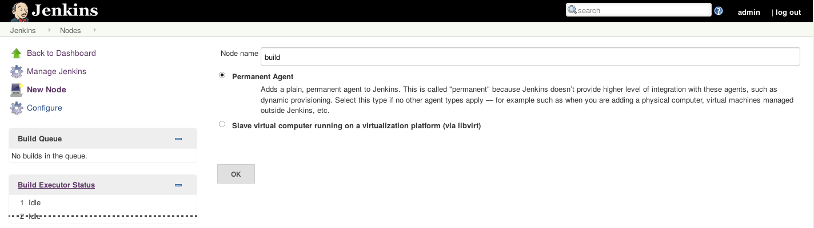
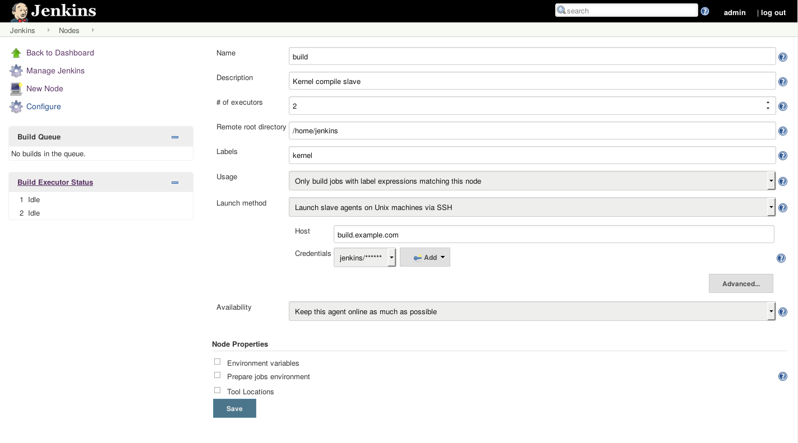

Jenkins CI-RT
=============
:toc:
:toclevels: 3

This git repository hosts all configuration xml files (node
configuration xml files are not stored here) as well as all installed
plugins used for the CI-RT Jenkins instance.

The following HOWTO explains all required setup steps to reproduce the
CI-RT testing infrastructure. It is split into several steps:

. Setup of Jenkins instance

. Setup of Jenkins slaves: for kernel compile jobs and for a test
target, explanation of test procedure and setup of git test
description

. Setup of CI-RT web instance (with data base that is filled via
Jenkins with test results) (see
https://github.com/ci-rt/ci-web[CI-RT web])

The CI-RT infrastructure setup is explained in detail
https://ci-rt.linutronix.de/about.jsp[here].

Setup of Jenkins instance ("Master")
------------------------------------

The Jenkins instance is setup on a Debian 8 (Jessie) based system.

Required Packages
~~~~~~~~~~~~~~~~~

The following Debian packages are required. Jenkins and
jenkins-debian-glue packages are not hosted by default Debian package
repositories (see <<install-jenkins, "Install Jenkins">> for detailed
installation instructions):

* openssh-client
* openssh-server
* bash
* git
* rsync
* sudo
* acpid
* acpi-support
* ntpdate
* ntp
* python-numpy
* python-sqlalchemy
* python-psycopg2
* postgresql-client-9.4
* jenkins

If the identical infrastructure Linutronix built up for CI-RT should
be used, a tool called r4d (Remote For DUT) and an adapted version of libvirt
supporting r4d, are needed as well as the library for r4d.

* https://github.com/ci-rt/r4d[r4d]
* https://github.com/ci-rt/libr4d[libr4d]
* https://github.com/ci-rt/libvirt-debian[libvirt-debian]

[[install-jenkins]]
Install Jenkins
^^^^^^^^^^^^^^^

The install instruction for Jenkins is documented on
https://wiki.jenkins-ci.org/display/JENKINS/Installing+Jenkins+on+Ubuntu[Jenkins
wiki].

Please make sure, that you install a Jenkins instance of the Version
2.x . Jenkins is downward compatible within a version number.

There is a problem with automatically starting the systemd jenkins
service. Please make sure this was the only error during
installation. Then start jenkins manually:

----
$ sudo systemctl start jenkins.service
----

Configure Jenkins
~~~~~~~~~~~~~~~~~

After installation, first login should be done. Therefore the Jenkins
web interface needs to be opened. Then please follow the displayed
instructions.

Afterwards stop Jenkins before loading the new configuration:

----
$ sudo systemctl stop jenkins.service
----

Clone git repository with Jenkins configuration and plugins as user
jenkins (to ensure the file permissions are set correctly), touch all
files and sync files into JENKINS_HOME:

----
sudo su - jenkins
git clone https://github.com/ci-rt/jenkins.git
cd jenkins
find . -exec touch {} \;
rsync -aP --exclude .git --exclude README.adoc --exclude images /PATH/TO/GIT/CLONE/ /var/lib/jenkins/
----

Afterwards start Jenkins:

----
$ sudo systemctl start jenkins.service
----

Configure database / database access
~~~~~~~~~~~~~~~~~~~~~~~~~~~~~~~~~~~~

Jenkins needs a database to fill in the test results. For setup of the
database please consider
https://github.com/ci-rt/database/blob/master/README.adoc[database
README].

The credentials for the database access needs to be stored in the
~/.pgpass file. This file needs the the mode 0600. For more
information like structure of file content please consider
https://www.postgresql.org/docs/current/static/libpq-pgpass.html[postgresql
documentation].

For the database access, an environment variable "PGSQL" is set with
the default hostname option. There the hostname of the database server
needs to be set properly for your own needs:

image:/images/pgsql-config.png[]

Please make sure, that you use PSGQL only with "-c" option instead of
stdin for the command to be executed. This is the only possibility to
check whether there was a fault in executing the SQL command.

Jenkins Plugins
~~~~~~~~~~~~~~~

The Jenkins plugins are loaded with the configuration. Probably, newer
versions of the plugins are available. The plugins can be updated, but
then it is not ensured, that everything works as expected.

Another particularity plugin is the Jenkins libvirt slaves
plugin. This plugin is modified, so that an adapted version of libvirt
can be used. The adapted version of libvirt can communicate with
_r4d_. This tool abstracts the communication with systems, which are embedded
into https://www.osadl.org/Test-Rack.test-rack.0.html[test racks] as used
in the OSADL QA farm. More detailed information about the
infrastructure used in CI-RT is available
https://ci-rt.linutronix.de/RT-Test/about.jsp[here].

Sources of the adapted Jenkins libvirt slaves plugin can be found
https://github.com/ci-rt/libvirt-slave-plugin[here]

The Jenkins warnings plugin is a collection of parsers to parse compile and
other output for errors and warnings. The plugin is used to handle gcc output
while compiling the kernel, look for BUGS and WARNINGS while booting and
search for errors and warning from cyclictest. The output is dressed for
Jenkins and is available through the Jenkins UI.

Sources of the adapted Jenkins warning plugin can be found
https://github.com/ci-rt/warning-plugin[here]

Sources of r4d can be found https://github.com/ci-rt/r4d[here].
Sources of libr4d can be found https://github.com/ci-rt/libr4d[here].
Sources of adapted libvirt version can be found https://github.com/ci-rt/libvirt[here]

Use r4d in test environment
~~~~~~~~~~~~~~~~~~~~~~~~~~~

If r4d should be used, please consider
https://github.com/ci-rt/r4d/blob/master/README.adoc[r4d README],
https://github.com/ci-rt/libr4d/blob/master/README.adoc[libr4d README]
and
https://github.com/ci-rt/libvirt-debian/blob/debian/jessie-backports/README.adoc[libvirt
with r4d support README] for setup/installation instructions of all
needed software parts.

After successful installation of r4d, libr4d and the adapted version
of libvirt, Jenkins master instance needs to be configured to
communicate with r4d via libvirt:

image:/images/r4d-cloud.png[]

Setup of Jenkins slaves
-----------------------

All Jenkins instances are known as Jenkins Nodes. The Jenkins main
instance is already configured as "Master".

The CI-RT testing infrastructure uses two different types of slaves:

* one slave for kernel compile jobs
* several slaves as test targets

The slaves itself need to be setup. Afterwards it needs to be defined
in Jenkins configuration (those configuration files are not public on
github).

Jenkins supports two different types of slaves:

* Permanent Agent
* Slave virtual computer running on a virtualization platform (via libvirt)

The
https://wiki.jenkins-ci.org/display/JENKINS/Step+by+step+guide+to+set+up+master+and+slave+machines[Jenkins
wiki] describes how to setup an agent in general.

Setup of slave for kernel compile jobs
~~~~~~~~~~~~~~~~~~~~~~~~~~~~~~~~~~~~~~

The setup of the slave can be split into all tasks, that has to be
done on the slave itself and the creation of a new node in the Jenkins
master.

Slave settings
^^^^^^^^^^^^^^

The kernel compile Jenkins slave is a Debian 8 based system.

The installation of the following packages is required:

* build-essentials
* All needed cross compilers
* ntpdate
* ntpd
* openssh-server
* openjdk-8-jre-headless

A mirror of the kernel git repository is created locally to prevent
cloning the repository every time from a remote git mirror. It is
updated via cron job.

A user "jenkins" has to be created.

Jenkins Master settings
^^^^^^^^^^^^^^^^^^^^^^^

During the first ssh connection the executor gets the hint, that the
authenticity of host can't be established. After confirmation to
continue, the host is permanently added known_hosts file. Next time
connecting to this host, there is no need for user interaction. That's
why a ssh connection to the kernel compile slave should be executed
manually before Jenkins try to do so.

After this, the Jenkins node can be created. For the kernel compile
slave the _Permanent Agent_ is chosen as slave type:

Here you can find a filled in example of the kernel compile slave:

"Labels" specify the task, the slave can process. In this case it has
to be "kernel". The credentials and the host for the launch method has
to be filled with your own settings.

Slave as test target
~~~~~~~~~~~~~~~~~~~~

The slave needs a functional bootloader and kernel with kexec and
network support. A root file system with all required packages and
settings is provided by Linutronix and can be downloaded
https://ci-rt.linutronix.de/download/target-elbe-rfs[here]. If RFS
modifications are required, the RFS can be rebuilt using
http://elbe-rfs.org[elbe]. The xml files are hosted in
https://github.com/ci-rt/elbe-rfs[elbe-rfs repository].

A full list with all system requirements to insert a test target into
https://ci-rt.linutronix.de/RT-Test/about.jsp[Linutronix testing
infrastructure] is given
https://ci-rt.linutronix.de/download/system-requirements.pdf[here].

The Linutronix test infrastructure uses a modified libvirt version to
handle power cycle and serial output of machines. The sources are
available https://github.com/ci-rt/libvirt[here]. The debian package
sources are available https://github.com/ci-rt/libvirt-debian[here].

This is the reason why the test target slaves are defined as _Slave
virtual computer running on a virtualization platform (via libvirt)_
. Here is a screenshot of an exemplary configuration of a test target
slave called iommu:

image:/images/iommu-details.png[]
